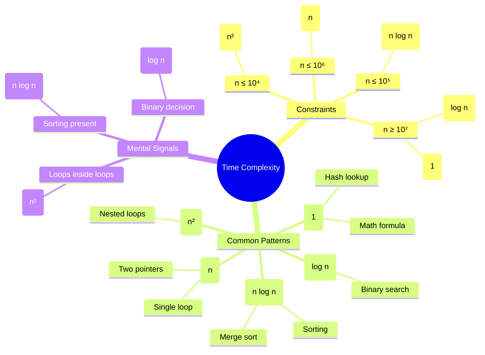

Understanding Time complexity is bit intimidating for me initially but as I started learning algorithms I found it easy to understand. So this is a blog to understand the time complexity of algorithms. There will be short cuts which anyone can be used for studying the algorithms.

## Time complexity and constrains with mapping with algorithm patterns

Any constrains above 10**8 is above 1 second time complexity is considered as a Time Limit Exceeded or TLE in leetcode. So our try will be to reduce the time complexity to 10**8. The below table explains the time complexity for each pattern.

| Input Size | Time Complexity            | Leetcodepatterns                                                                                                                                    |
| ---------- | -------------------------- | --------------------------------------------------------------------------------------------------------------------------------------------------- |
| 10**18     | O(log n)                   | Math number theory, Bit manipulation, Binary exponentiation, fast doubling, Modular arithmetic                                                      |
| 10**12     | O(squareroot(n)) / O(logn) | segment tree , coordinate compressions, prefix sum, Binary search                                                                                   |
| 10**8      | O(n)                       | Greedy, sounting, som esorting                                                                                                                      |
| 10**7      | O(n)                       | Sliding window, prefix sum, frequency counting, Bit tricks                                                                                          |
| 10**6      | O(nlogn) or O(n)           | linear scan, prefix sum, counting, bucket based logic, sliding window mathematical formulas                                                         |
| 10**5      | O(nlogn)                   | Sorting, binary search, two pointer, hashing, sweep line, heap operations, Fenwick Tree, Segment Tree                                               |
| 10**4      | O(n**2)                    | Pairwise comparisons, 2D DP                                                                                                                         |
| 10**3      | O(n**3)                    | Matrix DP, Interval DP, Fllyod Warshall                                                                                                             |
| 10**2      | O(n**3) or O(n**4)         | State DP, Brute Force, Complex transistion                                                                                                          |
| <= 25      | O(2**n)  or O(2**n * n)    | Subset DP, BitMasking, Meet-in-the-middle                                                                                                           |
| <= 15      | O(n.2**n)                  | Subset enumeration, Bitmask DP, State compression, Meet in the middle, DFS over choices (pick/not pick)                                             |
| <= 10      | O(n!)                      | Backtracking, permutaion combination, DFS with pruning Bitmask DP, generate permutation, try all possible orders, constraints satisfaction problems |

Special patterns:

- O(V+E) Graph pattern: BFS, DFS, Topological sort, Union Find, Diijkstra(with heap), Kruskal
- O(V*V) Matrix pattern: Floyd warshall, Matrix chain multiplication
- O(N**3) Matrix pattern: Matrix chain multiplication
- O((n+q) log n) Queries pattern: Binary Indexed Tree, Segment Tree, Fenwick Tree, Sparse Table, Persistent Segment Tree, Persistent Fenwick Tree, Persistent Sparse Table



``` mermaid
mindmap
  root((Time Complexity))
    Calculation
      amortized (mathematical)
      runtime (enumeration)
    Progression
      arithematic (O(n**2)) (1+2+3+n)
        bubble sort
        triangular loops
        pairwise comparisons
        DP
      geometric (O(log n))
        merge sort
        binary search
        heap operation
        tree height
      harmonic O(nlogn)
        sieve of eratosthenes
        hash table resize
        union find
        string matching
```


